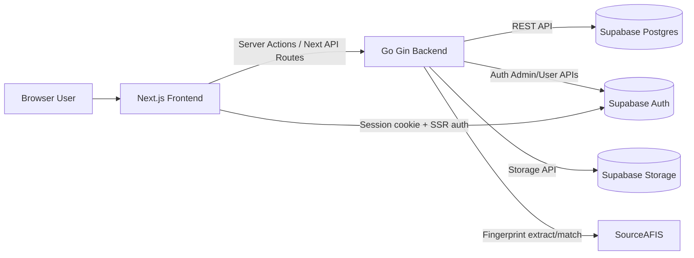

# Prototipo_Autenticacion_Registro_Asistencia - Full Technical Documentation

Document version: 2026-05-24

This document consolidates the current architecture, API surface, database schema, and delete side effects for the codebase.

It is based on:

- Go backend routes and handlers
- Backend service logic
- Next.js frontend API routes and server actions
- Supabase migration history under frontend/supabase/migrations

## 1. System Overview

The system is a school operations platform for:

- Student and professor management
- Course assignment
- Attendance registration with fingerprint identification
- Payment and debt tracking
- Course material management (folders/files/YouTube links/covers)
- Role-based access using Supabase Auth + profiles

Primary runtime components:

- Frontend: Next.js 16 + React 19 (frontend)
- Backend: Go 1.25 + Gin (backend)
- Database/Auth/Storage: Supabase (PostgreSQL + Auth + Storage)
- Biometric matching: SourceAFIS via Go

## 2. Architecture And Communication

### 2.1 Request path (standard CRUD)

1. Browser triggers UI action.
2. Frontend server action or frontend API route calls backend using callBackend/callBackendRaw.
3. Backend enforces middleware rules (origin/key restrictions), validates payload, executes domain logic.
4. Backend reads/writes Supabase tables through REST API endpoints (/rest/v1/\*).
5. Backend returns JSON envelope (typically success/data/error).

### 2.2 Security and access control layers

- Frontend role checks:
  - ensureApprovedAdmin
  - ensureApprovedRoles
  - resolveCurrentUserAccess via /api/auth/resolve-access
- Backend middleware checks:
  - CORS middleware
  - FrontendOnlyMiddleware for /api/\* (except health)
  - Accepts authorized frontend origin and optional X-Backend-Access-Key bypass
- DB-level checks:
  - RLS policies on core tables
  - is_approved_admin and is_approved_admin_or_professor helper functions

### 2.3 Biometric flow

1. Frontend captures fingerprint PNG (base64).
2. Payload sent to backend endpoint.
3. Backend extracts SourceAFIS template.
4. Template is AES-GCM encrypted before storage.
5. Identification endpoint decrypts stored templates and matches against probe template.

### 2.4 Materials flow

- Files and images are uploaded through backend to Supabase Storage.
- Metadata is persisted in public.course*material*\* tables.
- YouTube links are represented as pseudo-files in course_material_files with content_type video/youtube.

## 3. Backend API - Complete Endpoint Catalog

Base: backend service (default port 4000)

Response style:

- Most endpoints return JSON with success and data/error.
- Some health endpoints return simple status payloads.
- Some file endpoints return binary content.

## 3.1 Health

| Method | Path        | Description                                              | Params |
| ------ | ----------- | -------------------------------------------------------- | ------ |
| GET    | /health     | Composite health check (backend + frontend health probe) | none   |
| GET    | /api/health | Backend health and fingerprint threshold                 | none   |
| HEAD   | /api/health | Health probe                                             | none   |

## 3.2 Students

| Method | Path                                                    | Description                                                            | Params                                 |
| ------ | ------------------------------------------------------- | ---------------------------------------------------------------------- | -------------------------------------- |
| POST   | /api/students/enroll                                    | Legacy/compat enrollment flow (student only, no managed auth creation) | Body: StudentEnrollRequest             |
| POST   | /api/students/create                                    | Main student creation flow with managed auth user + DB insert          | Body: StudentEnrollRequest             |
| GET    | /api/students                                           | List students                                                          | none                                   |
| GET    | /api/students/:numero_identificacion                    | Get one student                                                        | Path: numero_identificacion            |
| GET    | /api/students/:numero_identificacion/attendance-summary | Student attendance counters                                            | Path: numero_identificacion            |
| POST   | /api/students/exists                                    | Check student existence                                                | Body: StudentExistsRequest             |
| POST   | /api/students/update                                    | Update student record                                                  | Body: StudentUpdateRequest             |
| POST   | /api/students/delete                                    | Delete student record                                                  | Body: StudentDeleteRequest             |
| POST   | /api/students/:numero_identificacion/profile            | Ensure student profile exists                                          | Path: numero_identificacion            |
| DELETE | /api/students/:numero_identificacion/profile            | Delete student profile                                                 | Path: numero_identificacion            |
| POST   | /api/students/update-fingerprints                       | Update only student fingerprints                                       | Body: UpdateStudentFingerprintsRequest |

Student-related body contracts:

### StudentEnrollRequest

- tipo_identificacion: string
- numero_identificacion: string
- no_matricula: string|null
- nombres: string
- apellidos: string
- email: string|null
- grado: string
- telefono: string|null
- direccion: string|null
- barrio: string|null
- nombre_acudiente: string|null
- telefono_acudiente: string|null
- eps: string|null
- coordinador_academico: string
- programa: string|null
- fecha_inicio: string|null
- fecha_matricula: string|null
- valor_matricula: number|null
- medio_pago_matricula: string
- valor_apoyo_semanal: number
- huella_indice_derecho: string|null (legacy plaintext PNG base64)
- huella_indice_izquierdo: string|null (legacy plaintext PNG base64)
- huella_indice_derecho_encrypted: {iv, ciphertext}|null (AES-GCM PNG)
- huella_indice_izquierdo_encrypted: {iv, ciphertext}|null (AES-GCM PNG)

### StudentUpdateRequest

- numero_identificacion: string
- data: object (patch keys accepted by service)
  - tipo_identificacion
  - numero_identificacion
  - no_matricula
  - nombres
  - apellidos
  - email
  - grado
  - telefono
  - direccion
  - barrio
  - nombre_acudiente
  - telefono_acudiente
  - eps
  - coordinador_academico
  - programa
  - fecha_inicio
  - fecha_matricula
  - valor_matricula
  - medio_pago_matricula
  - valor_apoyo_semanal

### StudentExistsRequest

- numero_identificacion: string

### StudentDeleteRequest

- numero_identificacion: string

### UpdateStudentFingerprintsRequest

- numero_identificacion: string
- huella_indice_derecho: string|null (legacy)
- huella_indice_izquierdo: string|null (legacy)
- huella_indice_derecho_encrypted: {iv, ciphertext}|null
- huella_indice_izquierdo_encrypted: {iv, ciphertext}|null

## 3.3 Professors

| Method | Path                                           | Description                          | Params                       |
| ------ | ---------------------------------------------- | ------------------------------------ | ---------------------------- |
| POST   | /api/professors/create                         | Create professor + managed auth user | Body: ProfessorCreateRequest |
| GET    | /api/professors                                | List professors                      | none                         |
| GET    | /api/professors/:numero_identificacion         | Get professor                        | Path: numero_identificacion  |
| POST   | /api/professors/exists                         | Check professor existence            | Body: ProfessorExistsRequest |
| POST   | /api/professors/update                         | Update professor                     | Body: ProfessorUpdateRequest |
| POST   | /api/professors/delete                         | Delete professor                     | Body: ProfessorDeleteRequest |
| POST   | /api/professors/:numero_identificacion/profile | Ensure professor profile exists      | Path: numero_identificacion  |
| DELETE | /api/professors/:numero_identificacion/profile | Delete professor profile             | Path: numero_identificacion  |

ProfessorCreateRequest fields:

- tipo_identificacion
- numero_identificacion
- nombres
- apellidos
- telefono
- direccion
- barrio
- nombre_contacto_emergencia
- telefono_contacto_emergencia
- eps
- email

ProfessorUpdateRequest:

- numero_identificacion
- data (patch object for same editable fields)

ProfessorExistsRequest:

- numero_identificacion

ProfessorDeleteRequest:

- numero_identificacion

## 3.4 Courses and Participant Assignment

| Method | Path                                 | Description                             | Params                           |
| ------ | ------------------------------------ | --------------------------------------- | -------------------------------- |
| GET    | /api/courses                         | List courses                            | none                             |
| GET    | /api/courses/options                 | Minimal course options                  | none                             |
| GET    | /api/courses/:id_curso               | Get one course                          | Path: id_curso (int)             |
| POST   | /api/courses/exists                  | Check course existence                  | Body: CourseExistsRequest        |
| POST   | /api/courses/create                  | Create course                           | Body: course fields object       |
| POST   | /api/courses/update                  | Update course                           | Body: CourseUpdateRequest        |
| POST   | /api/courses/delete                  | Delete course                           | Body: CourseDeleteRequest        |
| POST   | /api/courses/participants/lookup     | Resolve ids as student/professor        | Body: ParticipantLookupRequest   |
| POST   | /api/courses/participants/associate  | Link participants to course             | Body: ParticipantMutationRequest |
| POST   | /api/courses/participants/dissociate | Unlink participants from course         | Body: ParticipantMutationRequest |
| GET    | /api/courses/:id_curso/participants  | Get student+professor rows for a course | Path: id_curso                   |
| GET    | /api/courses/:id_curso/students      | Get only students for a course          | Path: id_curso                   |

Course create/update accepted fields:

- nombre_curso
- nivel_curso
- hora_inicio
- hora_fin
- salon
- fecha_inicio (optional override)
- fecha_fin (optional override)

Important behavior:

- On create, backend injects default fecha_inicio=2000-01-01 and fecha_fin=2999-12-31 unless provided.

CourseExistsRequest:

- id_curso: int

CourseUpdateRequest:

- id_curso: int
- data: object

CourseDeleteRequest:

- id_curso: int

ParticipantLookupRequest:

- participant_ids: string[]

ParticipantMutationRequest:

- id_curso: int
- participant_ids: string[]

## 3.5 Course Materials

| Method | Path                                            | Description                        | Params                                                  |
| ------ | ----------------------------------------------- | ---------------------------------- | ------------------------------------------------------- | ------------------- |
| GET    | /api/course-materials/snapshot                  | Full materials snapshot for course | Query: id_curso; user_id via query/header/form          |
| POST   | /api/course-materials/folders/create            | Create folder                      | Body: id_curso, parent_folder_id                        | null, name, user_id |
| PATCH  | /api/course-materials/folders/update            | Rename folder                      | Body: id_curso, folder_id, name, user_id                |
| POST   | /api/course-materials/folders/delete            | Delete folder subtree              | Body: id_curso, folder_id, user_id                      |
| POST   | /api/course-materials/files/upload              | Upload file(s) multipart           | Multipart: id_curso, folder_id, files[]; user_id/header |
| POST   | /api/course-materials/files/delete              | Delete one file                    | Body: id, user_id                                       |
| POST   | /api/course-materials/files/youtube/create      | Create YouTube link pseudo-file    | Body: id_curso, folder_id, url, title, user_id          |
| GET    | /api/course-materials/files/:id/download        | Download binary file               | Path: id; Query: user_id                                |
| POST   | /api/course-materials/cover/upload              | Upload course cover image          | Multipart: id_curso, image, user_id                     |
| POST   | /api/course-materials/cover/url                 | Set course cover as external URL   | Body: id_curso, image_url, user_id                      |
| GET    | /api/course-materials/cover                     | Download/redirect course cover     | Query: id_curso, user_id                                |
| POST   | /api/course-materials/folders/card/upload       | Upload folder card image           | Multipart: id_curso, folder_id, image, user_id          |
| POST   | /api/course-materials/folders/card/url          | Set folder card external URL       | Body: id_curso, folder_id, image_url, user_id           |
| GET    | /api/course-materials/folders/:id/card/download | Download/redirect folder card      | Path: id; Query: user_id                                |

Materials access rules enforced server-side:

- Reading: approved administrador/profesor/estudiante.
- Managing: approved administrador/profesor only.
- Additional student restriction: students with clases_adeudadas > 0 are blocked from materials access.

## 3.6 Attendance

| Method | Path                     | Description                                         | Params                             |
| ------ | ------------------------ | --------------------------------------------------- | ---------------------------------- |
| GET    | /api/attendance/roster   | Attendance roster by course/date                    | Query: id_curso, date (YYYY-MM-DD) |
| POST   | /api/attendance/save     | Upsert attendance rows and optional payment linkage | Body: AttendanceSaveRequest        |
| POST   | /api/attendance/delete   | Delete attendance entries for course/date           | Body: AttendanceDeleteRequest      |
| GET    | /api/attendance/export   | Export rows by course/date                          | Query: id_curso, date              |
| GET    | /api/attendance/dates    | Distinct attendance dates for a course              | Query: id_curso                    |
| POST   | /api/attendance/identify | Identify student in course by fingerprint           | Body: AttendanceIdentifyRequest    |

AttendanceSaveRequest:

- id_curso: int
- date: string
- rows: AttendanceSaveRow[]
- save_timestamp_iso: string|null
- registrado_por: string|null

AttendanceSaveRow:

- numero_identificacion: string
- asistio: boolean
- saldo: string|null (cancelado/debe)
- metodo_pago: string|null
- marcado_en: string|null

AttendanceDeleteRequest:

- id_curso: int
- date: string

AttendanceIdentifyRequest:

- id_curso: int
- fingerprint_template: string (PNG base64)

## 3.7 Payments

| Method | Path                                                | Description                  | Params                                               |
| ------ | --------------------------------------------------- | ---------------------------- | ---------------------------------------------------- |
| GET    | /api/payments/student/:numero_identificacion/status | Student + recent payments    | Path: numero_identificacion                          |
| POST   | /api/payments/process                               | Process debt/advance payment | Body: ProcessStudentPaymentRequest                   |
| POST   | /api/payments/manual-status                         | Manual saldo override        | Body: ManualStudentPaymentStatusUpdateRequest        |
| GET    | /api/payments/report                                | Payments report              | Query: numero_identificacion, from, to, scope, limit |

ProcessStudentPaymentRequest:

- numero_identificacion: string
- registrado_por: string (uuid)
- metodo_pago: string
- modalidad: string (DEUDA_TOTAL, DEUDA_PARCIAL, ADELANTO)
- clases: int
- notas: string|null
- id_curso: int|null

ManualStudentPaymentStatusUpdateRequest:

- numero_identificacion: string
- clases_adeudadas: int
- clases_adelantadas: int
- notas: string|null

Payments report filters:

- numero_identificacion: optional
- from: optional date
- to: optional date
- scope: ASISTENCIA or PROCESADOR (other values treated as all)
- limit: int (default 50, max 5000)

## 3.8 Dashboard, Person Identification, Auth, Utility

| Method | Path                                     | Description                                                   | Params                          |
| ------ | ---------------------------------------- | ------------------------------------------------------------- | ------------------------------- |
| GET    | /api/dashboard/summary                   | Dashboard counts                                              | none                            |
| GET    | /api/person/by-id/:numero_identificacion | Identify person by ID (student/professor + courses)           | Path: numero_identificacion     |
| POST   | /api/person/identify-by-fingerprint      | Identify person by fingerprint (global students template set) | Body: fingerprint_template      |
| POST   | /api/auth/sign-in                        | Supabase password sign-in                                     | Body: AuthSignInRequest         |
| POST   | /api/auth/sign-up                        | Supabase sign-up                                              | Body: AuthSignUpRequest         |
| POST   | /api/auth/recover                        | Password recovery                                             | Body: AuthRecoverRequest        |
| POST   | /api/auth/verify-otp                     | OTP verification                                              | Body: AuthVerifyOTPRequest      |
| POST   | /api/auth/session-user                   | Get session user from token                                   | Body: AuthAccessTokenRequest    |
| POST   | /api/auth/update-password                | Update password + optional metadata                           | Body: AuthUpdatePasswordRequest |
| POST   | /api/auth/sign-out                       | Sign out token                                                | Body: AuthAccessTokenRequest    |
| POST   | /api/auth/resolve-access                 | Resolve role/approval/fullname from profiles/admin fallback   | Body: ResolveAccessRequest      |
| GET    | /startService                            | Fingerprint capture service status stub                       | none                            |

Auth body contracts:

- AuthSignInRequest: email, password
- AuthSignUpRequest: email, password, metadata, email_redirect_to
- AuthRecoverRequest: email, redirect_to
- AuthVerifyOTPRequest: type, token_hash
- AuthAccessTokenRequest: access_token
- AuthUpdatePasswordRequest: access_token, password, data
- ResolveAccessRequest: user_id, email, user_metadata

## 4. Frontend API Routes (Next.js)

These are frontend-facing endpoints under frontend/src/app/api. Most wrap backend endpoints and enforce frontend-side role checks.

| Method(s)           | Frontend Route                         | Main behavior                                                   |
| ------------------- | -------------------------------------- | --------------------------------------------------------------- |
| GET                 | /api/admins                            | Uses server action getAdmins (Supabase admin table read)        |
| POST                | /api/attendance/identify               | Role check then direct backend call to /api/attendance/identify |
| POST                | /api/auth/sign-in                      | Proxy to backend /api/auth/sign-in                              |
| POST                | /api/auth/sign-up                      | Proxy to backend /api/auth/sign-up                              |
| POST                | /api/auth/recover                      | Proxy to backend /api/auth/recover                              |
| POST                | /api/auth/verify-otp                   | Proxy to backend /api/auth/verify-otp                           |
| POST                | /api/auth/session-user                 | Proxy to backend /api/auth/session-user                         |
| POST                | /api/auth/update-password              | Proxy to backend /api/auth/update-password                      |
| POST                | /api/auth/sign-out                     | Proxy to backend /api/auth/sign-out                             |
| GET, POST           | /api/course-materials/cover            | Read/set cover (URL or upload) via backend cover endpoints      |
| POST                | /api/course-materials/files/upload     | Multipart stream proxy to backend upload                        |
| POST                | /api/course-materials/files/youtube    | Proxy to backend /api/course-materials/files/youtube/create     |
| GET, DELETE         | /api/course-materials/files/:id        | Download/delete material file via backend                       |
| POST, PATCH, DELETE | /api/course-materials/folders          | Create/rename/delete folders via backend                        |
| GET, POST           | /api/course-materials/folders/:id/card | Download/set folder card (URL or upload) via backend            |
| POST                | /api/courses/create                    | Uses server action createCourse                                 |
| POST                | /api/person-identification/identify    | Mode=id or fingerprint; composes backend person endpoints       |
| POST                | /api/professors/create                 | Uses server action createProfessor                              |
| POST                | /api/professors/update                 | Uses server action updateProfessor                              |
| GET                 | /api/start-service                     | Direct fetch to backend /startService                           |
| POST                | /api/students/create                   | Admin check then backend /api/students/create                   |
| POST                | /api/students/update                   | Server action update + direct backend fingerprint update call   |

## 5. Data Model And Schema (Current Operational Model)

This section reflects the effective schema from migrations.

## 5.1 Enums

- public.grado_enum
- public.metodo_pago_enum (uppercase labels EFECTIVO, TRANSFERENCIA, NEQUI, DAVIPLATA, OTRO)
- public.saldo_enum (cancelado, debe)
- public.role_enum (administrador, estudiante, profesor)
- public.tipo_pago_enum (clase_presencial, adelanto, abono_matricula, otro, pago_deuda)
- public.origen_pago_enum (asistencia, procesador)

## 5.2 Core tables

### public.administrador

Columns:

- id uuid PK, FK auth.users(id) ON DELETE CASCADE
- tipo_identificacion
- numero_identificacion
- nombres
- apellidos
- email
- role
- created_at

### public.profiles

Columns:

- id uuid PK, FK auth.users(id) ON DELETE CASCADE
- nombre
- apellido
- email
- role role_enum
- approved boolean
- created_at
- updated_at

### public.estudiantes

Columns:

- tipo_identificacion
- numero_identificacion PK
- auth_user_id uuid FK auth.users(id) ON DELETE SET NULL
- no_matricula UNIQUE
- nombres
- apellidos
- email
- grado
- telefono
- direccion
- barrio
- nombre_acudiente
- telefono_acudiente
- eps
- coordinador_academico
- programa
- fecha_inicio
- fecha_matricula
- valor_matricula
- medio_pago_matricula
- valor_apoyo_semanal
- huella_indice_derecho (nullable, non-empty if present)
- huella_indice_izquierdo (nullable, non-empty if present)
- created_at
- updated_at
- deleted_at

### public.profesores

Columns:

- numero_identificacion PK
- auth_user_id uuid FK auth.users(id) ON DELETE SET NULL
- tipo_identificacion
- nombres
- apellidos
- telefono
- direccion
- barrio
- nombre_contacto_emergencia
- telefono_contacto_emergencia
- eps
- email
- created_at
- updated_at

### public.cursos

Columns:

- id_curso PK
- nombre_curso
- nivel_curso
- hora_inicio
- hora_fin
- salon
- fecha_inicio
- fecha_fin
- created_at
- updated_at
- last_modified_at

### public.cursos_x_estudiantes

Columns:

- numero_identificacion FK estudiantes(numero_identificacion) ON UPDATE CASCADE ON DELETE CASCADE
- id_curso FK cursos(id_curso) ON DELETE CASCADE
- fecha_inscripcion
- PK(numero_identificacion, id_curso)

### public.cursos_x_profesores

Columns:

- numero_identificacion FK profesores(numero_identificacion) ON UPDATE CASCADE ON DELETE CASCADE
- id_curso FK cursos(id_curso) ON DELETE CASCADE
- fecha_inscripcion
- PK(numero_identificacion, id_curso)

### public.registro_asistencia

Columns:

- id PK
- numero_identificacion FK estudiantes(numero_identificacion) ON UPDATE CASCADE ON DELETE CASCADE
- id_curso FK cursos(id_curso) ON DELETE CASCADE
- fecha
- asistio
- saldo
- metodo_pago
- created_at
- id_pago uuid FK pagos(id) ON DELETE SET NULL

### public.saldo_estudiantes

Columns:

- numero_identificacion PK, FK estudiantes(numero_identificacion) ON UPDATE CASCADE ON DELETE CASCADE
- clases_adelantadas
- clases_adeudadas
- total_pagado
- ultima_actualizacion

### public.pagos

Columns:

- id uuid PK
- numero_identificacion nullable FK estudiantes(numero_identificacion) ON UPDATE CASCADE ON DELETE SET NULL
- id_curso FK cursos(id_curso) ON UPDATE CASCADE ON DELETE RESTRICT
- id_asistencia FK registro_asistencia(id) ON DELETE SET NULL
- registrado_por FK auth.users(id) ON DELETE RESTRICT
- origen_pago origen_pago_enum
- tipo_pago tipo_pago_enum
- metodo_pago metodo_pago_enum
- valor
- clases_adelantadas
- notas
- fecha_pago
- created_at

### public.course_material_course_settings

Columns:

- id_curso PK FK cursos(id_curso) ON DELETE CASCADE
- cover_storage_bucket
- cover_storage_path
- updated_by FK auth.users(id) ON DELETE SET NULL
- updated_at

### public.course_material_folders

Columns:

- id PK
- id_curso FK cursos(id_curso) ON DELETE CASCADE
- parent_folder_id FK self(id) ON DELETE CASCADE
- name
- created_by FK auth.users(id) ON DELETE SET NULL
- created_at
- updated_at
- card_storage_bucket
- card_storage_path

### public.course_material_files

Columns:

- id PK
- id_curso FK cursos(id_curso) ON DELETE CASCADE
- folder_id FK course_material_folders(id) ON DELETE CASCADE
- file_name
- storage_bucket
- storage_path
- content_type
- file_size
- uploaded_by FK auth.users(id) ON DELETE SET NULL
- created_at

## 5.3 Views

- public.vista_saldo_acumulado
- public.vista_deuda_estudiantes
- public.vista_reporte_pagos

## 5.4 Critical triggers/functions

Identity/profile/auth sync:

- handle_new_user_profile_link
- sync_profile_from_admin
- sync_profile_from_estudiante
- sync_profile_from_profesor
- trg_on_auth_user_created
- trg_sync_profile_admin
- trg_sync_profile_estudiante
- trg_sync_profile_profesor

Delete synchronization:

- handle_profile_deleted_delete_auth
- handle_admin_deleted_delete_auth
- handle_auth_user_deleted_cleanup_public
- trg_profile_deleted_delete_auth
- trg_admin_deleted_delete_auth
- trg_auth_user_deleted_cleanup_public

Attendance/payment automation:

- handle_new_estudiante + trg_new_estudiante_saldo
- handle_new_pago + trg_new_pago
- handle_asistencia_pago + trg_asistencia_saldo

Timestamp/update normalization triggers:

- set_updated_at_estudiantes / cursos / profesores / profiles
- set_last_modified_at_cursos
- course material updated_at triggers

Uppercase normalization triggers (if present in environment):

- force_uppercase_administrador
- force_uppercase_cursos

## 5.5 RLS policy model (high level)

- Admin-gated tables use is_approved_admin() for full CRUD.
- Materials management uses is_approved_admin_or_professor().
- Authenticated approved users can read materials tables.
- profiles includes self-read and admin policies.
- profesores includes approved admin all + self-read policy.

## 6. Delete Behavior Matrix (DB Reactions)

This section answers exactly what happens after each delete operation.

| Operation                                 | Immediate service action                                                                                                                                                                  | DB FK/trigger side effects                                                                                                                                                                             | Result summary                                                                          |
| ----------------------------------------- | ----------------------------------------------------------------------------------------------------------------------------------------------------------------------------------------- | ------------------------------------------------------------------------------------------------------------------------------------------------------------------------------------------------------ | --------------------------------------------------------------------------------------- |
| POST /api/students/delete                 | Deletes from cursos_x_estudiantes, registro_asistencia, saldo_estudiantes, then deletes estudiantes row (where deleted_at is null), then deletes linked auth user if auth_user_id present | pagos.numero_identificacion now ON DELETE SET NULL, so payment rows are preserved; auth user deletion triggers profile/admin cleanup functions                                                         | Student business record removed, history payments preserved with null student reference |
| POST /api/professors/delete               | Deletes cursos_x_profesores links, deletes profesores row, deletes linked auth user if any                                                                                                | auth delete cleanup trigger nulls auth_user_id in linked tables and removes profile/admin records                                                                                                      | Professor removed and auth/profile cleaned up                                           |
| POST /api/courses/delete                  | Deletes curso row                                                                                                                                                                         | Cascades to cursos*x_estudiantes, cursos_x_profesores, registro_asistencia, course_material*\* via FK cascades; pagos.id_curso is ON DELETE RESTRICT so existing payment references can block deletion | Course deletion may fail if pagos still reference id_curso                              |
| POST /api/attendance/delete               | Deletes registro_asistencia rows for a date window                                                                                                                                        | registro_asistencia.id_pago FK to pagos is ON DELETE SET NULL from attendance side; pagos remain                                                                                                       | Attendance rows removed, payments remain but may lose id_asistencia link                |
| POST /api/course-materials/folders/delete | Deletes folder row at DB (subtree cascades via self-FK); service also attempts storage object cleanup for files/cards                                                                     | course_material_files child rows cascade delete by folder FK                                                                                                                                           | Folder subtree metadata removed, storage objects best-effort deleted                    |
| POST /api/course-materials/files/delete   | Optional storage object delete then DB row delete                                                                                                                                         | none beyond row delete                                                                                                                                                                                 | File metadata removed; object removed unless YouTube pseudo-file                        |
| DELETE /api/students/:id/profile          | Deletes profiles row                                                                                                                                                                      | Trigger deletes auth.users row; auth delete cleanup trigger nulls auth_user_id in estudiantes/profesores and deletes admin/profile rows                                                                | Profile deletion can propagate to auth user deletion                                    |
| DELETE /api/professors/:id/profile        | Same as above                                                                                                                                                                             | Same as above                                                                                                                                                                                          | Same as above                                                                           |
| deleteAdmin server action                 | Deletes auth user by ID                                                                                                                                                                   | administrador.id FK ON DELETE CASCADE removes admin row; auth delete trigger removes profile/nulls links                                                                                               | Admin and auth/profile entities removed together                                        |

Important note on soft delete:

- A deleted_at column exists on estudiantes.
- Current backend delete path performs physical DELETE for students, not logical soft delete update.
- Some read/update queries still filter deleted_at is null.

## 7. Endpoint-to-Table Touch Map

High-level read/write usage by module:

- Students API: estudiantes, cursos_x_estudiantes, registro_asistencia, saldo_estudiantes, profiles, auth.users
- Professors API: profesores, cursos_x_profesores, profiles, auth.users
- Courses API: cursos, cursos_x_estudiantes, cursos_x_profesores
- Attendance API: registro_asistencia, cursos_x_estudiantes, estudiantes, saldo_estudiantes, pagos
- Payments API: pagos, saldo_estudiantes, vista_reporte_pagos, estudiantes, cursos, profiles
- Person identification: estudiantes, profesores, cursos_x_estudiantes, cursos_x_profesores, cursos
- Course materials API: course_material_course_settings, course_material_folders, course_material_files, profiles, saldo_estudiantes, Supabase Storage
- Auth API: Supabase Auth endpoints + profiles/administrador fallback for resolve-access

## 8. Operational Configuration

Critical backend env vars:

- SUPABASE_URL
- SUPABASE_SERVICE_ROLE_KEY
- SUPABASE_ANON_KEY (optional but used for auth calls when set)
- FRONTEND_HEALTH_URL
- FRONTEND_ORIGIN
- BIOMETRIC_BACKEND_ACCESS_KEY (optional shared key)
- BIOMETRIC_PASSPHRASE_PNG
- BIOMETRIC_PASSPHRASE_TEMPLATE
- MATCH_THRESHOLD (optional)
- SUPABASE_MATERIALS_BUCKET (for materials storage)

Critical frontend env vars:

- NEXT_PUBLIC_SUPABASE_URL
- NEXT_PUBLIC_SUPABASE_ANON_KEY
- SUPABASE_SERVICE_ROLE_KEY
- BIOMETRIC_BACKEND_URL
- BIOMETRIC_BACKEND_INTERNAL_URL (optional)
- FRONTEND_ORIGIN
- BIOMETRIC_BACKEND_ACCESS_KEY (optional)

## 9. Known Implementation Notes

- Course create defaults to perpetual date bounds unless explicitly overridden.
- metodo_pago enum values are uppercase in current app code and migrations.
- Student/coordinator constraints evolved over migrations (case-relax migration exists).
- YouTube links are stored as pseudo-file rows; duplicate policy is per-folder for YouTube URLs.
- Student materials access is blocked if saldo_estudiantes.clases_adeudadas > 0.

## 10. Quick API Checklist (for integrators)

- Use /api/auth/\* endpoints for token/session lifecycle.
- Use /api/auth/resolve-access after auth session to resolve role + approval.
- For student/professor creation, backend manages auth user creation and links auth_user_id.
- For attendance save, expect business logic updates in saldo_estudiantes and optional pagos creation.
- For deleting students, payment history is preserved in pagos.
- For course deletion, check for pagos.id_curso references due RESTRICT behavior.
- For materials upload, send multipart/form-data and include user identity (header/form/query as required).

---

If you want, a next iteration can add:

- machine-readable OpenAPI-style endpoint spec
- full SQL DDL reconstruction in one canonical order
- sequence diagrams for each major business flow
